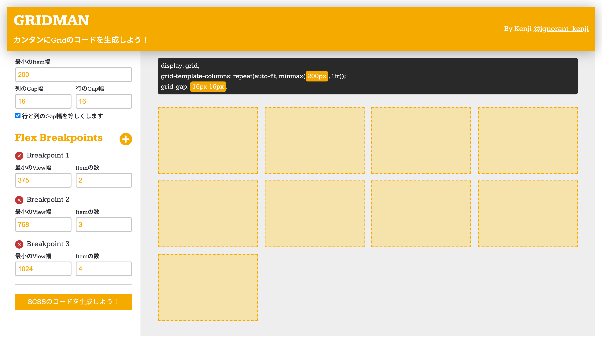

# GridMan



## できること

左の画面で最小幅や Gap 幅を操作でき、 BreakPoint の追加や行の数を指定できます。
右の画面で Items の最小の幅や各 Item の行や列の Gap 幅を調節を確認できます。

入力を確認したら、ぜひ SCSS のコードをを生成しよう！ボタンを押下してください

## SCSS のコードを生成する

Web 制作で再利用が可能、Sass のミックスコードを生成されます

## フォルダ構成

```
リポジトリTOP
├── README.md .. 目次を書く
├── img .. 制作物のイメージ
│   └── screen.png
├── index.html
├── js
│   ├── main.js .. なんか動いたコード
│   └── main2.js .. オブジェクト志向を意識して書いたコード
└── styles
    ├── libs
    │   ├── _animation.scss
    │   ├── _base.scss
    │   └── _modal.scss
    ├── main.css
    ├── main.css.map
    ├── main.scss
    └── vendors
        └── reset.scss
```

## What it can do

CSS Grid minmax function is used to dynamically make a responsive layout with a specificed item width. On the left side, you can control the minimum width and spacing between grid items.

Then, you can edit or add Flexbox breakpoints. Once that is done, click on CSS のコードをを生成しよう！ to get the ready to use Sass code.

## Generated Code

The code generated is a Sass mixin that can be reused in your project.

## Suggestions

Do you have a comment or suggestion?
